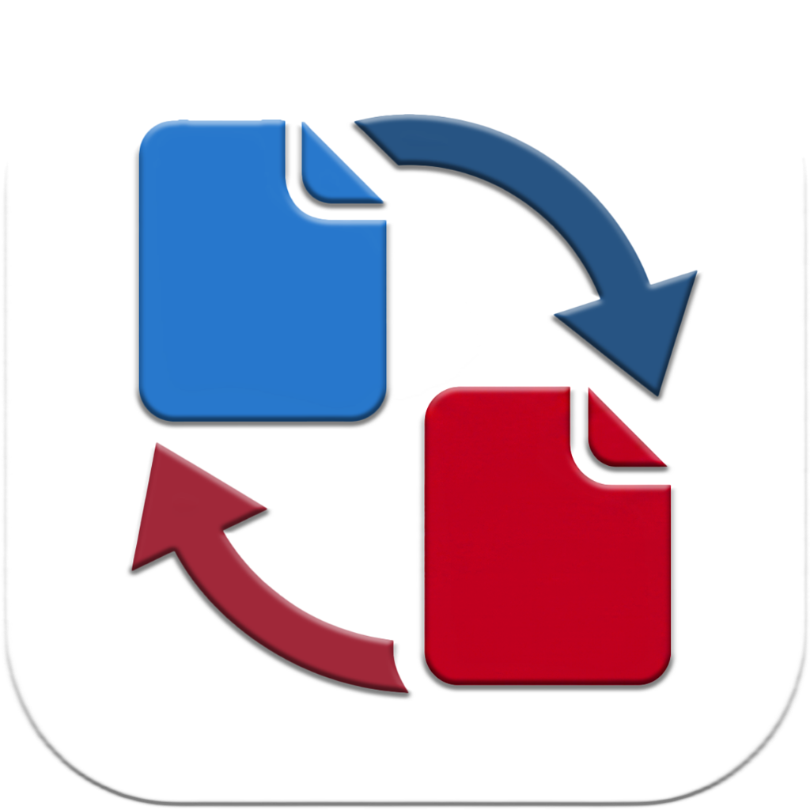

<p align="center">
  
</p>

<h1 align="center">Any Converter</h1>

<p align="center">
  <strong>Fast, Private & Offline File Converter for Windows</strong>
</p>

<p align="center">
  <a href="CHANGELOG.md"></a>
  <a href="https://python.org"></a>
  <a href="https://flet.dev"></a>
  <a href="LICENSE"></a>
  <a href="SUPPORTED_FORMATS.md"></a>
</p>

---

**Any Converter** is a fast, modern, and completely private desktop application for converting your media, documents, vector graphics, 3D models, databases, and archives—entirely on your PC.

No file size limits. No cloud uploads. No subscriptions. 100% free and open source.

---

## ✨ Key Highlights

- 🔒 **100% Private & Offline:** Your files stay on your computer. All processing happens locally with zero data sent to external servers.
- ⚡ **Lightning Fast & Multi-Threaded:** Batch convert multiple files simultaneously with real-time progress tracking.
- 🎨 **Beautiful Modern UI:** A sleek, glassmorphic interface with dark/light themes, customizable accent colors, and interactive drag-and-drop.
- 🔄 **Smart Fallback Engine:** Automatically cascades across installed office suites (Microsoft Office, LibreOffice, WPS Office) for seamless document conversions.
- 🧩 **Zero-Setup Dependencies:** Automatically configures conversion engines (FFmpeg, Assimp 3D) on first launch—no manual setup required.

---

## 🗂️ What Can You Convert?

Any Converter supports **over 100+ file extensions** across 13 major categories:

| Category | Highlights & Formats | Converts To |
| :--- | :--- | :--- |
| **🖼️ Images** | PNG, JPG, WebP, GIF, HEIC/HEIF, AVIF, JXL, BMP, ICO, TIFF, PSD, RAW, INDD | PNG, JPG, WebP, GIF, HEIC, AVIF, BMP, ICO, TIFF |
| **🎥 Video** | MP4, MKV, AVI, MOV, WebM, WMV, FLV, MXF, HLS (`.m3u8`), DASH (`.mpd`), CMAF | MP4, MKV, AVI, MOV, WebM, WMV, Audio extraction |
| **🎵 Audio** | MP3, WAV, FLAC, M4A, AAC, OGG, Opus, AIFF, ALAC, High-Res DSD/DFF, Tracker modules | MP3, WAV, FLAC, M4A, AAC, OGG, Opus, AIFF |
| **📄 Documents** | DOCX, DOC, WPD, WPS, ODT, RTF, HTML, TXT, XLS, XLSX, PPT, PPTX, Visio, Publisher, MS Project | PDF |
| **✒️ Vector Graphics** | SVG, AI, EPS, PS, CorelDRAW (`.cdr`), XPS, OXPS | PNG, JPG, WebP, PDF, SVG |
| **🧊 3D Models & CAD** | OBJ, STL, PLY, GLB, GLTF, FBX, STEP, IGES, DXF, DWG, OpenSCAD (`.scad`), DWF, 3DS | OBJ, STL, PLY, GLB, GLTF, FBX, STEP |
| **📚 PDFs & E-Books** | PDF, EPUB, MOBI, AZW3, DJVU, CBR, CBZ, CB7 comic archives | PDF, Image pages (PNG/JPG) |
| **📊 Data & Config** | JSON, YAML, CSV, XML, vCard (`.vcf`), iCalendar (`.ics`) | JSON, YAML, CSV, XML, PDF |
| **🗄️ Databases** | SQLite (`.db`, `.sqlite`), SQL Dumps, MS Access (`.mdb`, `.accdb`) | SQL, SQLite, JSON, CSV, XML, YAML |
| **🗺️ Geospatial** | GeoJSON, KML, KMZ, GPX, Shapefiles (`.shp`) | GeoJSON, KML, GPX, CSV, JSON |
| **📦 Archives** | ZIP, RAR, 7Z, TAR, GZ, ISO optical images, MDF/MDS disk images | ZIP, 7Z, TAR, ISO, Folder extraction |
| **💬 Subtitles** | SRT, VTT, ASS, SSA, SUB, SCC | SRT, VTT, ASS, SUB, TXT |
| **🔤 Fonts** | TTF, OTF, WOFF, WOFF2, EOT, Mac `.dfont` | TTF, OTF, WOFF, WOFF2, EOT |

👉 *Check out [SUPPORTED_FORMATS.md](SUPPORTED_FORMATS.md) for the complete list of supported extensions.*

---

## 🚀 Quick Start

### Running from Source

1. **Clone the repository:**
   ```bash
   git clone https://github.com/sayandey021/Any-Converter.git
   cd Any-Converter
   ```

2. **Install dependencies & run:**
   ```bash
   pip install -r requirements.txt
   python main.py
   ```
   *Any Converter automatically sets up FFmpeg and 3D engines on first launch.*

---

## 📦 Building Executable Binary

To package a standalone portable `.exe` for Windows:
```cmd
build.bat
```
Select option `1` to generate a self-contained executable under `dist/AnyConverterApp.exe`.

---

## 📄 License

Distributed under the MIT License. See [LICENSE](LICENSE) for details.
