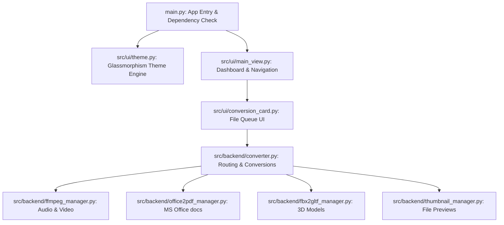

<p align="center">
  
</p>

<h1 align="center">Any Converter</h1>

<p align="center">
  <a href="https://python.org"></a>
  <a href="https://flet.dev"></a>
  <a href="https://opensource.org/licenses/MIT"></a>
  <a href="https://makeapullrequest.com"></a>
</p>

**Any Converter** is a premium, fully-featured, offline-first desktop application that allows you to convert files across a massive array of formats—completely locally, with zero data leaving your machine.

With a gorgeous, glassmorphic UI, responsive layouts, customizable accent colors, and dynamic theme switching, **Any Converter** provides the visual polish of modern SaaS web apps in a lightweight, high-performance offline desktop wrapper.

---

## ✨ Features

- **🔒 100% Offline & Private:** Your files never leave your computer. All conversions are executed locally using high-performance native engines.
- **🎨 Stunning Glassmorphic UI:** A premium desktop interface designed with subtle micro-animations, theme options (light/dark), and customizable accent colors.
- **⚙️ Automated Dependency Setup:** Automatically detects and downloads engines like FFmpeg on first launch, requiring zero setup by the user.
- **📂 Bulk & Complex Operations:** Supports bulk queueing, multi-threaded conversion tasks, and detailed progress logs.
- **📦 Windows Native Packaging:** Includes built-in scripts to compile into portable single-file executables (`.exe`) or signed Windows Installer packages (`.msix`).

---

## 🧭 Project Architecture



---

## 📋 Supported Formats

Any Converter supports a comprehensive set of file format categories:

| Category | Input Extensions | Output Extensions | Native Engines |
| :--- | :--- | :--- | :--- |
| **🖼️ Images** | `.png`, `.jpg`, `.jpeg`, `.webp`, `.bmp`, `.gif`, `.heic`, `.heif`, `.psd`, `.ico`, `.tiff`, `.avif`, `.jxl`, `RAW` | `.png`, `.jpg`, `.jpeg`, `.webp`, `.bmp`, `.gif`, `.ico`, `.tiff`, `.avif`, `.jxl` | Pillow, Pillow-HEIF |
| **🎥 Video** | `.mp4`, `.mkv`, `.avi`, `.mov`, `.webm`, `.wmv`, `.flv`, `.f4v`, `.mxf`, `.asf`, `.mts`, `.vob`, `.ts`, `.3gp`, `.mpg` | `.mp4`, `.mkv`, `.avi`, `.mov`, `.webm`, `.wmv`, `.flv`, `.f4v`, `.mxf`, `.ts`, `.mpg` | FFmpeg |
| **🎵 Audio** | `.mp3`, `.wav`, `.flac`, `.m4a`, `.aac`, `.ogg`, `.aiff`, `.alac`, `.wma`, `.amr`, `.ac3`, `.eac3`, `.dts`, `.dtshd` | `.mp3`, `.wav`, `.flac`, `.m4a`, `.aac`, `.aiff`, `.alac`, `.wma`, `.amr`, `.ac3`, `.eac3`, `.thd`, `.dts` | FFmpeg |
| **📄 Documents** | `.doc`, `.docx`, `.docm`, `.dot`, `.rtf`, `.txt`, `.log`, `.odt`, `.xls`, `.xlsx`, `.ods`, `.ppt`, `.pptx`, `.pps` | `.pdf` | PyWin32 (Office API) / Internal Fallback |
| **📊 Data & Config** | `.json`, `.yaml`, `.yml`, `.csv`, `.xml` | `.json`, `.yaml`, `.yml`, `.csv`, `.xml`, `.pdf` | PyYAML, xmltodict, Pillow |
| **📚 PDFs & E-Books** | `.pdf`, `.epub`, `.mobi`, `.azw3`, `.azw`, `.iba`, `.djvu` | `.pdf`, `.png`, `.jpg`, `.jpeg`, `.webp` | PyMuPDF (Fitz) |
| **🧊 3D & CAD** | `.obj`, `.stl`, `.ply`, `.glb`, `.gltf`, `.off`, `.dae`, `.fbx`, `.step`, `.stp`, `.iges`, `.dxf`, `.dwg`, `.3mf` | `.obj`, `.stl`, `.ply`, `.glb`, `.gltf`, `.off`, `.dae` | Trimesh, FBX2glTF |
| **🗄️ Databases** | `.sql`, `.db`, `.sqlite`, `.sqlite3`, `.mdb`, `.accdb` | `.sql`, `.sqlite`, `.json`, `.csv`, `.xml`, `.yaml` | SQLite3 Python engine |
| **🗺️ Geospatial** | `.geojson`, `.kml`, `.kmz`, `.gpx`, `.shp` | `.geojson`, `.kml`, `.gpx`, `.csv`, `.json` | Standard geo-parsers |
| **📦 Archives** | `.zip`, `.rar`, `.7z`, `.tar`, `.gz`, `.tgz`, `.bz2`, `.xz`, `.iso`, `.img`, `.mds`, `.mdf` | `zip`, `7z`, `tar`, `tar.gz`, `tar.bz2`, `tar.xz`, `iso`, `folder` | pycdlib, zipfile, tarfile |
| **💬 Subtitles** | `.srt`, `.vtt`, `.ass`, `.ssa`, `.sub`, `.scc` | `.srt`, `.vtt`, `.ass`, `.sub`, `.scc`, `.txt` | Subtitle parser modules |
| **🔤 Fonts** | `.ttf`, `.otf`, `.woff`, `.woff2` | `.ttf`, `.otf`, `.woff`, `.woff2` | FontTools engine |
| **✒️ Vectors** | `.svg` | `.png`, `.jpg`, `.jpeg`, `.pdf`, `.svg` | PyMuPDF / CairoSVG fallback |

*For a granular breakdown, see [SUPPORTED_FORMATS.md](SUPPORTED_FORMATS.md).*

---

## 🛠️ Installation & Setup

### Prerequisites
- **Python 3.9** or higher installed on your computer.
- **Git** (optional, for cloning the repository).
- **Microsoft Office** (optional, required to convert legacy `.doc`, `.xls`, `.ppt` formats via win32 APIs).

### Step 1: Clone the Repository
```bash
git clone https://github.com/sayandey021/Any-Converter.git
cd Any-Converter
```

### Step 2: Set Up Virtual Environment (Recommended)
```bash
python -m venv venv
# On Windows:
venv\Scripts\activate
# On macOS/Linux:
source venv/bin/activate
```

### Step 3: Install Dependencies
```bash
pip install -r requirements.txt
```

### Step 4: Run the Application
```bash
python main.py
```
*On your very first run, Any Converter will automatically download and set up the FFmpeg engine. This process only occurs once.*

---

## 📦 Packaging and Compiling

Any Converter includes a native build tool (`build.bat`) to package your code for distribution.

Run the build script in Windows:
```cmd
build.bat
```

You will be presented with a menu:
1. **Build Standalone Portable Executable (EXE):** Creates a self-contained `.exe` file under `dist/AnyConverterApp.exe` with all assets, Python environment, and Flet dependencies bundled.
2. **Build Windows Installer Package (MSIX):** Compiles the application and generates a signed Windows App Package (`dist/AnyConverter.msix`) using MSIX packaging tools.
3. **Update Application Version:** Automatically increments the product metadata throughout the files.

---

## 🤝 Contributing

We welcome contributions to add support for new formats, optimize conversion speeds, or improve UI interactions! 

Please refer to our [CONTRIBUTING.md](CONTRIBUTING.md) for guidelines on code styles, opening issues, and pull request procedures.

---

## 📜 License

This project is licensed under the MIT License - see the [LICENSE](LICENSE) file for details.
